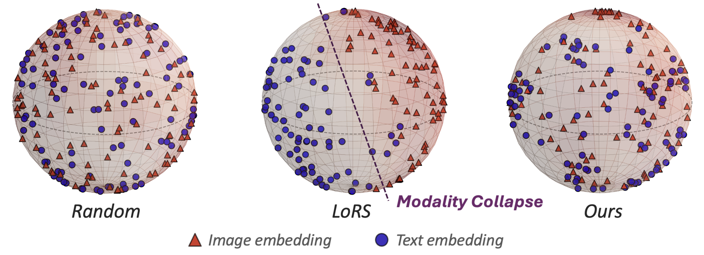

# 🌟 Beyond Modality Collapse: Representations Blending for Multimodal Dataset Distillation

>[Beyond Modality Collapse: Representations Blending for Multimodal Dataset Distillation](https://arxiv.org/pdf/2505.14705?). 
> [Xin Zhang](https://zhangxin-xd.github.io/), Ziruo Zhang, [Jiawei Du](https://scholar.google.com/citations?user=WrJKEzEAAAAJ&hl=zh-CN), [Zuozhu Liu](https://person.zju.edu.cn/en/lzz), [Joey Tianyi Zhou](https://joeyzhouty.github.io/)  
> Agency for Science, Technology, and Research (ASTAR), Singapore  
> National University of Singapore, Singapore  
> Zhejiang University, China 
## 📖 Introduction

<strong>Left</strong>: Multimodal embedding distributions across various distillation methods. We extract image and text embeddings from a finetuned CLIP and project them into a shared representation space using DOSNES. Red triangles and blue circles denote image and text embeddings, respectively. Left: Embeddings from randomly sampled data in the original dataset exhibit a well-spread and modality-aligned distribution. Middle: The distilled dataset generated by a sota MDD method (LoRS) leads to Modality Collapse, where image and text embeddings are poorly aligned and concentrated in distinct regions. Right: Our method effectively mitigates modality collapse, yielding a distribution that better preserves cross-modal alignment and exhibits greater representational diversity.

---
